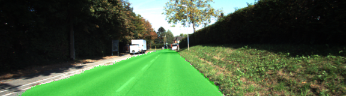

# Semantic Segmentation

The task of the project is to label the pixels of a road in images using a Fully Convolutional Network (FCN). 

## Architecture
A [FCN-8](https://people.eecs.berkeley.edu/%7Ejonlong/long_shelhamer_fcn.pdf) (Fully Convolutional Network) artificial neural network was implemented in the project. The network is from the encoder-decoder family of architectures. Its encoder network is used to map raw inputs to feature representations with spatial resolution reduction. A pretrained VGG-16 is utilized as the encoder. Decoder part transforms the feature representation into an output road mask with the desired resolution. Transposed convolution layers are used in the decoder parts for upsampling.

## Data preprocessing and augmentations
Two classes were created for training: road and background (all pixels other than the road).

Because the provided dataset is quite small, some input image augmentations were applied in order to enrich it, make more sustainable to color and scene variation and reduce overfitting. Several augmentations were applied to the input images with 50% probability:

* Random brightness and contrast variation by a linear function (of course, with clip into 0..255 range after the transformation);
* Horizontal image flip
* Random crop (quite useful as we have to decrease image resolution of the raw data before feeding it into the FCN)

## Training
Hyperparameter optimization was done manually after a series of experiments. Decoder weights initialization was done with a random normal initializer. Adam optimizer with initial learining rate 1e-4 was used for training the network as it usually provides good results. The network was trained for 30 epochs with batch size 16.
Actually, semantic segmentation task is a pixel classification task, so, a softmax cross entropy loss function was used as the main loss function in the task. In order to decrease overfitting and some artifacts on the predicted masks, an L2 regularization was applied to decoder convolutional layers. The approach required adding a regularization term into the loss. It can be done like so:
```Python
loss = ...
l2_loss = tf.losses.get_regularization_loss()
loss += L2_WEIGHT * l2_loss
```

The results looked very good and labelled at least 80% of the road:


